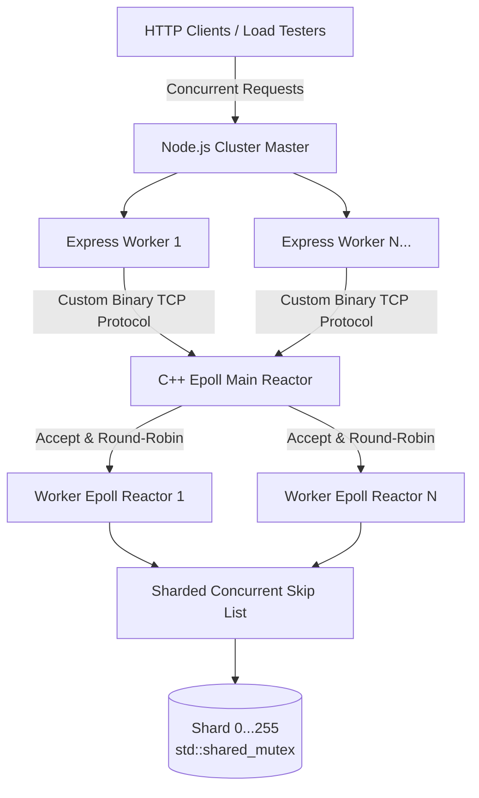

# TitanDB

TitanDB is a high-throughput, thread-safe in-memory key-value store. It is designed to act as a fast caching layer for heavy JSON payloads, effectively mitigating external API rate limits and reducing downstream response times for microservices.

## System Architecture



## Technical Stack & Features

### C++20 Storage Engine
- **Sharded Concurrent Skip List:** Replaces traditional hash maps to avoid collision overhead. Utilizes 256 distinct shards, each protected by `std::shared_mutex` for true concurrent reads and minimal writer contention.
- **Multi-Reactor Thread Pool:** Implements an Nginx-style event loop architecture. A main `epoll` reactor accepts incoming connections and distributes them across a pool of dedicated worker `epoll` reactors to fully utilize multi-core CPUs.
- **Custom Binary Protocol:** A lightweight, variable-length TCP protocol utilizing strict RAII memory management (`std::vector`).

### Node.js Integration
- **Cluster Load Balancing:** Utilizes the Node.js `cluster` module to fork API instances across all available CPU cores, eliminating single-thread bottlenecks.
- **Native TCP Driver:** A custom-built Promise-based driver that bypasses HTTP overhead by serializing keys and payloads directly into binary buffers.
- **Context Batching:** Supports an `OP_GET_CONTEXT` command to fetch multiple keys in a single network round-trip, optimizing Retrieval-Augmented Generation (RAG) data pipelines.

## Performance Benchmarks
Tested via `autocannon` handling heavy weather forecast JSON payloads:
- **Throughput:** ~2,700 Requests/sec (peaking at >5,300 req/sec).
- **Data Transfer:** 302 MB of JSON payloads served in 10 seconds (30+ MB/sec).
- **Response Time:** 12ms median response time under maximum concurrent load (100 simultaneous connections).

## Getting Started

### 1. Build the C++ Backend
```bash
chmod +x build.sh
./build.sh
./titandb_server
```

### 2. Run the Node.js API
```bash
cd api
npm install express
node server.js
```
